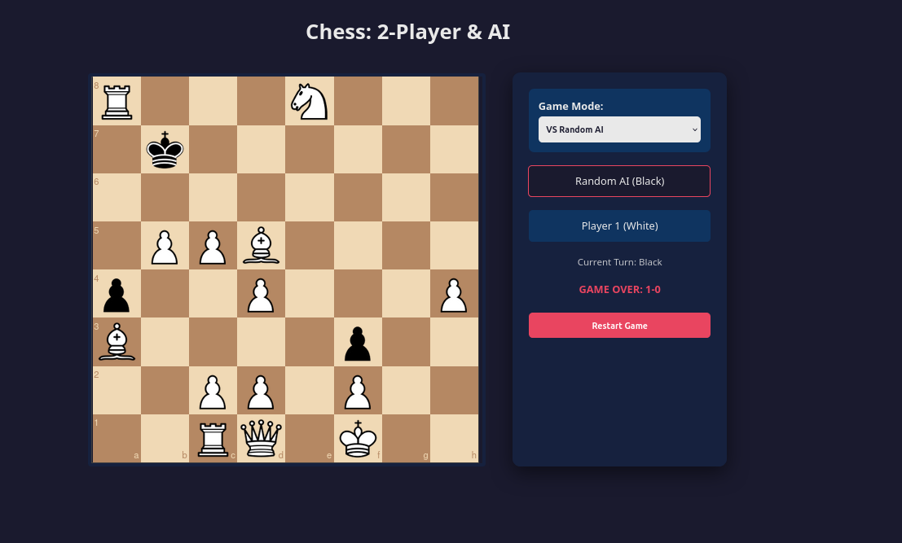

# flask-chess
Containerized Flask application for a chess game. It uses python-chess for the backend logic and chessboard.js with chess.js for the frontend interface.


Project Structure

### Create a directory named flask-chess and set up the following structure:

```bash

flask-chess/
├── app.py
├── requirements.txt
├── Dockerfile
├── docker-compose.yml
└── templates/
    └── index.html

```


1. The Backend (app.py)

### "Game Mode" (Player vs Player or Player vs AI). In AI mode, the server will automatically execute a random legal move for Black immediately after Player 1 (White) makes a move.

2. The Frontend (templates/index.html)

### This uses CDNs for the chess libraries. The pieces are loaded from the chessboardjs.com assets so you don't need to host local images.

3. Dependencies (requirements.txt)

4. Dockerization (Dockerfile)

5. Orchestration (docker-compose.yml)

How to Run

```bash

docker-compose up --build

```

Play: Open your browser and go to http://localhost:5000




